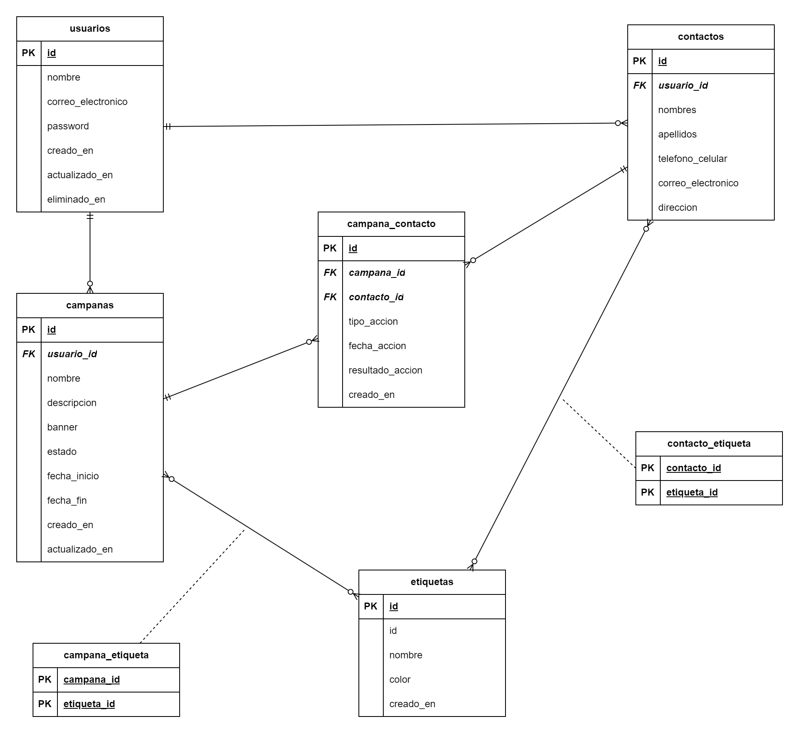

# Consumo de una API REST con VueJs

## Objetivo del curso

Aprender a consumir APIs REST utilizando Vue.js, incluyendo la realización de solicitudes HTTP, manejo de datos y conceptos de seguridad. Al final del curso, ser capaz de construir aplicaciones web interactivas que se conecten eficientemente con servicios externos. Adquirir las habilidades necesarias para integrar datos dinámicamente en aplicaciones Vue.js.

## Explicación de la API a consumir

### Diagrama Entidad Relación



### ¿Qué funcionalidades tendrá la API?

En este curso, nos enfocaremos en consumir una API REST para desarrollar una aplicación con Vue.js que permita a los vendedores gestionar campañas de marketing. Los usuarios podrán crear, gestionar estados y etiquetas de campañas, así como administrar contactos asignándoles etiquetas. Automatizaremos la dirección de campañas a contactos con etiquetas comunes durante el estado en proceso, y permitiremos el seguimiento de acciones realizadas por los usuarios. Finalmente, implementaremos la generación de reportes detallados tras la finalización de cada campaña para un análisis completo de su rendimiento.

### ¿Qué relaciones tendrán los recursos?

#### Usuario

- Un usuario tiene ninguno o muchos contactos
- Un usuario tiene muchas campañas

#### Contacto

- Un contacto pertenece a un usuario
- Un contacto tiene ninguna o muchas etiquetas
- Un contacto puede ser asignado a ninguna o muchas campañas

#### Etiqueta

- Una etiqueta pertenece a ninguno o muchos contactos
- Una etiqueta pertenece a ninguna o muchas campañas

#### Campaña

- Una campaña pertenece a un usuario
- Una campaña tiene ninguna o muchas etiquetas
- Una campaña tiene se asigna a ninguno o muchos contactos

#### Acción (Campaña - Contacto)

- Una acción pertenece a - un contacto
- Una acción pertenece a una campaña

## Configuración del Entorno de Desarrollo

- Node.js y npm o yarn
- MySQL (Laragon)
- Postman
- Git (opcional)
- VS Code
  - Configuraciones recomendadas - [settings.json](./.vscode/settings.json)
  - Extensiones recomendadas - [extensions.json](./.vscode/extensions.json)

## Instalación de Dependencias

```bash
$ yarn install
```

o con npm

```bash
$ npm install
```

## Ejecución de la aplicación

```bash

# modo desarrollo
$ yarn dev

# modo producción
$ yarn build
```

o con npm

```bash
# modo desarrollo
$ npm run dev

# modo producción
$ npm run build
```

## Autor

[willsonwill](https://github.com/willsonwill)
